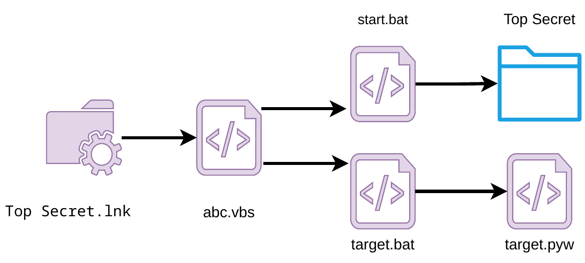
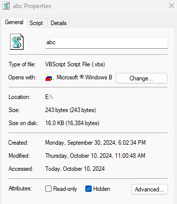
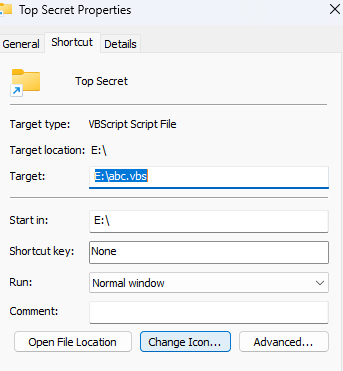
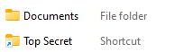
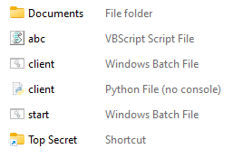

# infostealer
> [!WARNING]
> This code is meant for educational use only and should not be used for malicious activities.

This repository shows how to use an infostealer to steal the Firefox and wifi credentials of a Windows machine and send them to a C2 server.

## Firefox credentials
To steal Firefox credentials, we will decrypt the data of a profile that is stored in the logins.json file. To decrypt them we will use this python script [firefox_decrypt.py](https://github.com/unode/firefox_decrypt/blob/main/firefox_decrypt.py)

## Wifi credentials
To steal the wifi credentials we will just run powershell commands :
```powershell
netsh wlan show profiles #Get all the SSID
netsh wlan show profile "SSID" key=clear # Get SSID information, like key :)
```

## C2 Server
The C2 server will have a python script that waits for a victim to connect, then sends them the script to decrypt the Firefox credentials and waits to receive the wifi and Firefox credentials.

## USB
In our Usb we have :
+ `Top Secret.lnk`: A shortcut that looks like a folder, when we click on it it triggers `abc.vbs`.
+ `abc.vbs`: Visual Basic Scripting that start `start.bat` and `target.bat`. We use vbs to not have the console opening when we start the .pyw.
+ `Documents`:  Folder containing the folder `Top Secret` and the file `Top Secret\Secret_Data.pdf`.
+ `start.bat`: Batch file that open the folder `Documents\Top Secret`
+ `target.bat`: Batch file that start `target.pyw`
+ `target.pyw`: Python script that steals Firefox and wifi credentials and sends them to our C2 server. We use `pyw` instead of `py` because we don't want to open the console on startup.

In summary we have: 


In order that the victim does not see all these files we will hide them:



To encourage the victim to click on our shortcut we will change its icon to a folder:



What the victim sees :



What's really in the usb :


## Target requirement
+ The victim must click on the shortcut **Top Secret**.
+ The victime must have python.
+ Firefox keypass should not be locked with session password.
+ You need to change in **usb/abc.vbs** the USB device letter with the name of your USB device.:
    + `WshShell.Run chr(34) & "USB_LETTER:\target.bat" & Chr(34), 0`
    + `WshShell.Run chr(34) & "USB_LETTER:\start.bat" & Chr(34), 0`

## Demo
